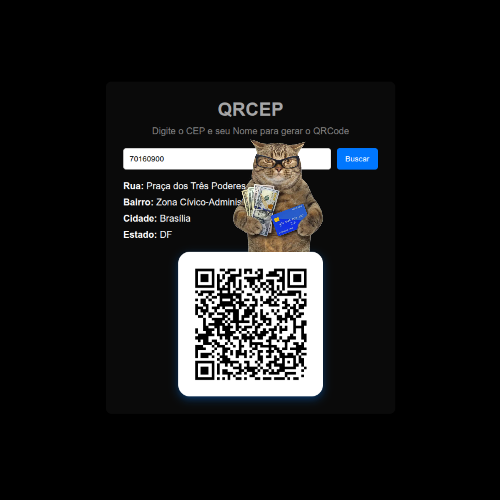

# Meu Projeto Para um sistema de login.

O QRCEP foi desenvolvido com o objetivo de modernizar processos simples de cadastro em pequenos órgãos públicos, como o CRAS, substituindo anotações manuais por um sistema digital mais rápido e organizado.

O sistema utiliza a API do para buscar automaticamente informações de localização através do CEP digitado e gera um QR Code contendo os dados do usuário, facilitando futuros atendimentos sem a necessidade de preencher informações repetidamente.

Além de ser um projeto de aprendizado em desenvolvimento web, o QRCEP também busca mostrar como soluções simples podem ajudar na organização, acessibilidade e modernização de serviços públicos.

# *link:* https://dege00.github.io/QRCEP/

